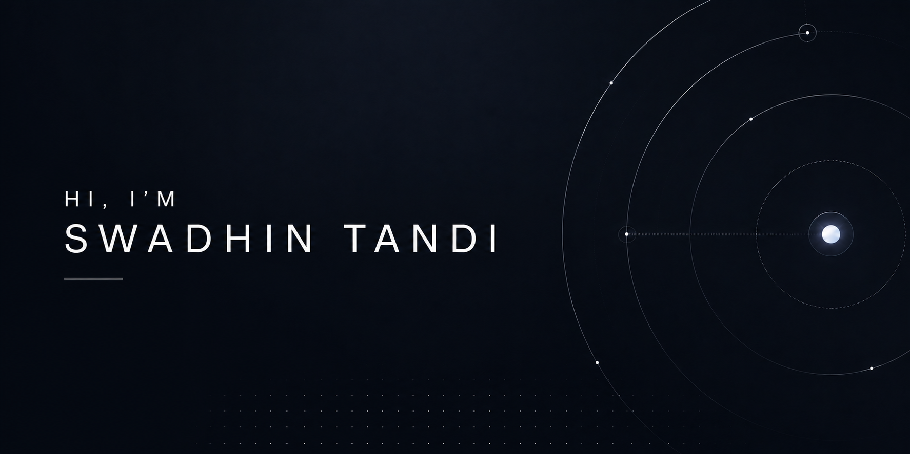

## Hi 👋

I'm an indie developer passionate about building scalable applications, developer tools, and automation solutions. I enjoy exploring full-stack development, cloud infrastructure, cybersecurity, and computer science while continuously learning new technologies and solving real-world problems.

## 📫 Reach Me

  
  
  
  

## 💡 Expertise

| Area                          | Description                                                                                                          |
| ----------------------------- | -------------------------------------------------------------------------------------------------------------------- |
| 🌐 **Full Stack Development** | Building modern, responsive, and scalable web applications with React, Next.js, Django, Flask, and Node.js.          |
| ☁️ **Cloud & DevOps**         | Deploying and managing applications on AWS, GCP, Vercel, with Docker, CI/CD, and modern cloud services.              |
| 🐍 **Python & Automation**    | Developing automation tools, CLI applications, web scrapers, bots, and data processing solutions.                    |
| 🔐 **Cybersecurity**          | Secure application development, vulnerability research, bug hunting, Linux, networking, and security best practices. |
| 🗄️ **Database Design**        | Designing efficient relational and NoSQL databases using PostgreSQL, MySQL, MongoDB, Redis, and MariaDB.             |
| 🧠 **Computer Science**       | Strong foundation in data structures, algorithms, mathematics, optimization, and software engineering principles.    |

## ⚡ Technologies & Tools

  
  
  
  
  
  
   
  
  
  
  
   
  
  
  
  
   
  
  
  

## 🚀 Projects

|  |  |
| ---------------------------------------------------------------------------------------------------------------------------------------------------------------------------------------- | ---------------------------------------------------------------------------------------------------------------------------------------------------------------------------------------- |
| **Movie Collection (Flask)** – Collection of your favorite movies and series. | **Crypticworld** – A growing toolkit for everyday security tasks. |
